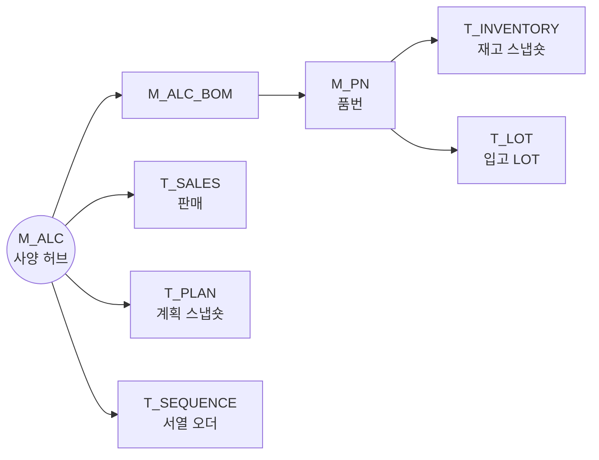

# manufacturing-scm-data-portfolio

**Manufacturing SCM × Data Modeling** — synthetic data portfolio

자동차 부품 제조 SCM 8년 차. 수요예측 · 공급계획 · 서열출하 · S&OP 현장에서 매일 반복되는 판단을 **데이터 구조와 SQL로 옮긴 무기(Weapon)** 모음.
**All data is synthetic.** 실무 구조만 본뜬 가상 데이터로 공개하며, 회사 실데이터는 포함하지 않는다.

> 재고는 합(SUM)이 아니라 곱(MIN)이다. 장부상 숫자와 실제로 가능한 숫자 사이의 간극을 드러내는 것이 이 포트폴리오의 공통 주제.

---

## Weapon Map

| 상태 | 의미 |
|---|---|
| ✅ | 완료 · 4종 세트 공개 |
| 🔨 | 구현 중 · 설계 완료, SQL 작성 단계 |
| 📐 | 설계 완료 · 구현 대기 |
| 🗄 | 보류 |

| # | 무기 | 현장 질문 | 핵심 기법 | 엔진 | 상태 |
|---|---|---|---|---|---|
| W0 | **Demand-Supply Monitor** | 수요와 공급이 언제 어긋나기 시작하는가 | `SUM(supply - demand) OVER (PARTITION BY … ORDER BY …)` | FLOW | 📐 |
| W1 | **[ALC BOM 역전개 · 대분재고](W1/)** | 흩어진 부품 재고로 실제 몇 세트를 출고할 수 있는가 | BOM 지문 그룹화, 우선순위 누적 배분, 병목 판정, Greedy vs MILP | BOM · SET | ✅ |
| W2 | **지역군 실적 정합** | 계획과 실적의 차이가 수량 문제인가, 시점 문제인가 | PIVOT → LONG 구조화, Anti-join 무결성 검증, 구성비 배분 | 정합 | 🔨 |
| W3 | **서열 버팀 검증** | 지금 재고로 서열 오더를 몇 번째 차까지 버틸 수 있는가 | `SUM() OVER (PARTITION BY pn ORDER BY seq)` — W1 엔진의 시간축 이식 | FLOW | 🔨 |
| W4 | **불용재고 감소 시점** | 불용 재고는 언제 소진되는가 | 시점 스냅숏 기반 번다운 | 시점 이력 | 🗄 |
| W5 | **PLM 이벤트 불용** | 설계 변경·단종 이벤트가 어떤 재고를 불용으로 만드는가 | 이벤트 × BOM 영향 추적 | 시점 이력 | 🗄 |
| W6 | **손실충당** | 장기·불용 재고의 손실 규모는 얼마인가 | 에이징 구간화, 충당 규칙 | FLOW | 📐 |
| W7 | **자재소요계획 (MRP)** | 생산 계획이 부품 소요로 어떻게 전개되는가 | 다단계 BOM 전개 | BOM · SET | 📐 |
| W8 | **선입선출 관리 (FIFO)** | 선입선출 위반이 어디서 손실을 만드는가 | LOT 순서 누적 비교 | FLOW | 📐 |
| W9 | **수요예측 정확도** | 예측은 얼마나, 어느 방향으로 틀리는가 | 월별 예측 스냅숏 이력 → 오차(MAPE)·편향 | 시점 이력 | 📐 |

**구현 순서:** W1 ✅ → W2 → W3 → W8 → W6 → W9 → W7
**후보:** 사양 조합 폭발(Trim-Level), 기준정보(MDM) 정합

---

## Architecture — ALC 허브 모델

모든 무기는 **ALC(완성 사양 코드)를 줄기**로, 품번을 잎으로 두고 같은 마스터를 공유한다. 여기에 **시점(스냅숏)** 축이 교차한다.

| 엔진 | 무엇을 푸는가 | 무기 |
|---|---|---|
| BOM · SET | 부품을 세트로 묶고, 병목이 세트 수를 정한다 | W1 · W7 |
| FLOW | 시간 순서로 누적하며 부족·위반이 생기는 지점을 찾는다 | W0 · W3 · W6 · W8 |
| 시점 이력 | 값을 덮어쓰지 않고 시점별로 남겨, 변화와 오차를 본다 | W4 · W5 · W9 |
| 정합 | 서로 다른 출처의 숫자를 같은 기준으로 맞춘다 | W2 |

**시점 이력 설계**는 W3 · W8 · W9를 관통하는 축이다. 데이터를 '현재 값'이 아니라 '시점별 이력'으로 다루는 것.

---

## 원칙

| 원칙 | 내용 |
|---|---|
| 설명 가능성 | 왜 그렇게 썼는지 설명할 수 있어야 통과. 최적해를 알아도 현장이 납득하는 규칙을 우선한다 (W1: Greedy 채택) |
| 4종 세트 | 무기마다 `01_problem` · `02_data_model` · `03_sql_logic` · `04_business_impact` |
| 가상 데이터 | 실무 구조만 본뜨고 코드·수량은 새로 생성. 실데이터·실제 코드명 미사용 |
| 도구 | SQLite · SQL · Python(pandas, scipy). 공개본 정리에 AI 코딩 도구를 보조로 사용 |

## Naming
`M_` 마스터 · `T_` 트랜잭션·스냅숏 · `R_` 관계 매핑 · `G_` 집계
