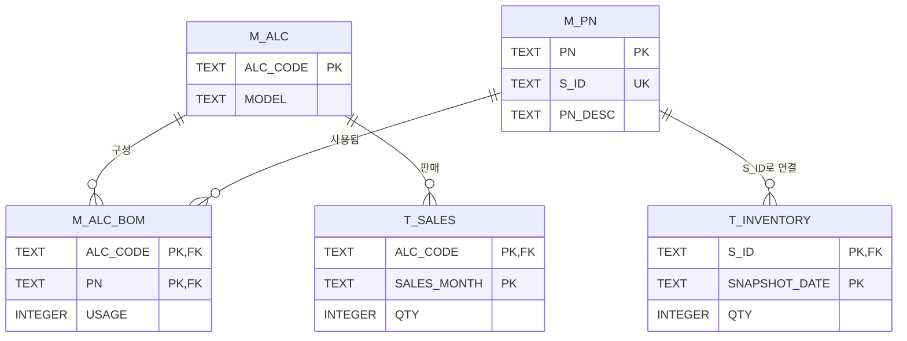

# 02 · Data Model

## 설계 판단
| 판단 | 이유 |
|---|---|
| ALC 코드를 그대로 기준 키로 | 고객사가 발행한 사양 코드를 조립사도 그대로 쓴다. 중간 번역 계층이 필요 없음 |
| `USAGE`를 BOM에 둠 | 같은 품번이 한 세트에 두 번 들어가는 경우가 실제로 있다 (좌·우 등). 사용량 2는 오류가 아님 |
| 재고는 `S_ID`로, 품번은 `M_PN`으로 분리 | 재고는 저장위치 단위로 잡히고, 품번과 1:1로 잇는 다리 키가 필요 |
| `SNAPSHOT_DATE`를 재고 PK에 포함 | 재고는 시점 값. 덮어쓰지 않고 이력을 남긴다 |
| 재고 범위는 커버링 품번까지 | 출고 판단의 단위가 커버링이기 때문. 원자재까지 내려가면 다른 문제가 됨 |

## 규모 (가상 데이터)
| 항목 | 수 |
|---|---|
| ALC | 72 (BOM이 같은 중복 24개 포함 → 그룹 48) |
| 품번 | 84 (차종 공통 36 · 공용 8 · 사양 전용 40) |
| BOM 행 | 416 |
