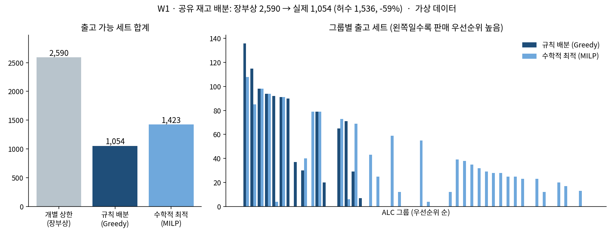

# W1 · 공유 재고로 실제 몇 세트를 출고할 수 있는가

**ALC BOM 역전개 · 공유 재고 배분 (Allocation)**

> 장부상 출고 가능 **2,590세트** → 공유 부품을 나눈 뒤 실제 **1,054세트**
> 차이 **1,536세트(-59%)** 는 공유 재고를 여러 사양이 중복으로 센 **허수**



## 한 줄 요약
품번 단위로 흩어진 재고를 완성 사양(ALC) 단위의 **출고 가능 세트**로 역전개하고, 여러 사양이 함께 쓰는 공유 부품을 **판매 우선순위대로 배분**해 장부상 숫자와 실제 가능량의 차이를 드러낸다.

## 4종 세트
| 파일 | 내용 |
|---|---|
| [01_problem.md](01_problem.md) | 무엇이 문제인가: 재고는 많아 보이는데 왜 못 만드는가 |
| [02_data_model.md](02_data_model.md) | 데이터 모델: ALC → BOM → 품번 → 저장위치 → 재고 |
| [03_sql_logic.sql](03_sql_logic.sql) | SQL: 개별 상한(Baseline)과 공유 배분(Greedy) |
| [04_business_impact.md](04_business_impact.md) | 결과와 판단: 허수 규모, Greedy vs MILP, 왜 규칙을 택했나 |

## 실행
```bash
python make_synthetic_data.py   # 가상 데이터 생성 (data/*.csv)
python build_db.py              # w1.db 생성 (SQLite)
sqlite3 w1.db < 03_sql_logic.sql   # SQLite 3.44 이상 (GROUP_CONCAT ... ORDER BY)
python 04_compare_milp.py       # Greedy vs MILP 비교 (scipy 필요)
python 04_plot.py               # 결과 그래프
```

## 데이터에 관하여
- 이 저장소의 모든 데이터는 실무 구조만 본떠 **새로 만든 가상 데이터**다. 코드·품번·수량 모두 난수.
- 문제 정의와 로직(중복 사양 그룹화, 우선순위 누적 배분, 병목 부품 판정)은 실무에서 직접 설계했다. 실무 데이터에 같은 로직을 적용했을 때도 같은 구조의 허수가 확인됐다(수치 비공개).
- 공개본의 가상 데이터 생성과 코드 정리는 AI 코딩 도구의 도움을 받았다.
